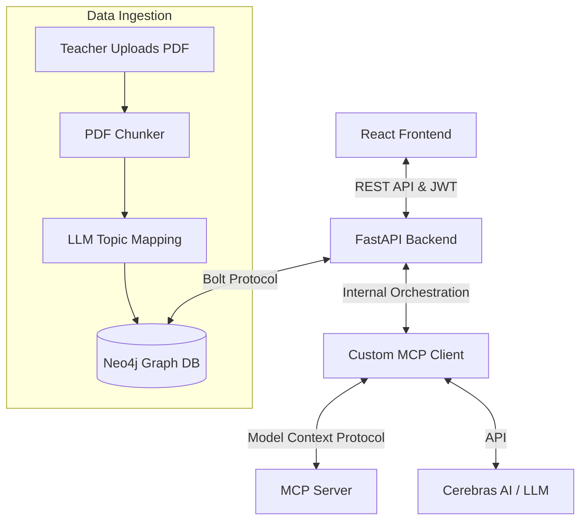

# StudyDB — AI-Powered Adaptive Quiz Platform

StudyDB is a full-stack, AI-driven educational platform that goes beyond standard testing. It uses a proprietary **Behavioral Evaluation Matrix** to analyze student performance at the millisecond level, and leverages **GraphRAG** via the **Model Context Protocol (MCP)** to provide context-aware, curriculum-grounded AI tutoring.

## 🚀 Key Features

### 1. Proprietary Behavioral Matrix
Instead of just scoring students as "Right" or "Wrong", StudyDB categorizes real-time student performance into four cognitive profiles based on expected-time baselines:
- **Optimal:** Fast & Correct (True mastery)
- **Methodical:** Slow & Correct (Understands, but needs confidence)
- **Reckless:** Fast & Incorrect (Rushing or guessing)
- **Struggling:** Slow & Incorrect (Deep knowledge gap)

### 2. GraphRAG Architecture
StudyDB bypasses the hallucinations of standard vector RAG by using an LLM at ingestion time to firmly attach content to a structured taxonomy in a graph database.
- Teachers upload PDF materials.
- The backend chunks the PDFs and uses Cerebras AI to semantically link content directly to curriculum `Topic` nodes in Neo4j.
- When a student asks a question, the AI retrieves *only* chunks that are explicitly linked to the relevant graph node, ensuring 100% curriculum-grounded answers.

### 3. Custom MCP Server & Client Architecture
Unlike most projects that just plug into Claude Desktop, StudyDB implements **both sides** of Anthropic's Model Context Protocol (MCP) from scratch:
- **MCP Server:** Exposes backend capabilities as standard MCP Tools, Prompts, and Resources.
- **MCP Client (`mcp_client.py`):** A custom Python SSE client that orchestrates the multi-step reasoning loop between the Cerebras LLM and the MCP Server.
- **Tools (Executable Actions):** The LLM can dynamically call tools to fetch student performance (`student_get_performance`), retrieve GraphRAG materials (`student_get_material`), or draft new quizzes (`teacher_generate_quiz_draft`).
- **Prompts (Workflows):** Strict, multi-step prompt templates (e.g., `/explain`, `/draft_quiz`) force the AI into structured behaviors, effectively acting as agentic state machines.
- **Resources (Context):** The AI is given explicit, read-only context boundaries (e.g., `db://schema`, `docs://quiz_guidelines`) to prevent hallucinations.
- **Client-Side Interception:** The custom MCP Client intercepts specific tool calls before they hit the LLM to trigger frontend React state changes (like popping open a quiz creation modal).

### 4. Full-Stack Orchestration
- **Frontend:** React (Vite) with custom Brutalist UI components.
- **Backend:** FastAPI with dual-layer caching (in-memory LRU + Redis design pattern) for sub-second analytical queries.
- **Database:** Neo4j (Native Graph Database) for complex multi-hop relationship traversals.
- **Deployment:** Fully containerized with Docker Compose for one-command reproducible deployment.

---

## 🛠️ Tech Stack

- **Frontend:** React, Vite, CSS (Custom Brutalist Design System)
- **Backend:** Python, FastAPI, Model Context Protocol (MCP) SDK, PyPDF
- **AI / LLM:** Cerebras AI (Llama 3 / GLM-4) for ultra-low latency inference
- **Database:** Neo4j, Cypher Query Language
- **Auth:** JWT (JSON Web Tokens), bcrypt password hashing
- **Infrastructure:** Docker, Docker Compose

---

## 🏗️ Architecture



---

## 🚦 Getting Started

### Prerequisites
- Docker and Docker Compose
- A Cerebras API Key (Free tier available)

### 1. Environment Setup
Create a `.env` file in the `backend/` directory:
```env
CEREBRAS_API_KEY=your_api_key_here
JWT_SECRET=your_super_secret_jwt_key
JWT_ALGORITHM=HS256
JWT_EXPIRE_HOURS=8
```

### 2. Start the Stack
Run the entire platform using Docker Compose:
```bash
docker-compose up --build -d
```
This starts:
- **Neo4j Database:** `localhost:7474` (Bolt: 7687)
- **FastAPI Backend:** `http://localhost:8000`
- **React Frontend:** `http://localhost:5173`

### 3. Seed the Database
The application requires initial taxonomy and constraints to function. Run the idempotent seed script to load the base curriculum, sample users, and sample quizzes:
```bash
docker exec -it studydb-mcp_backend-1 python seed.py
```

### 4. Login Credentials
The seed script creates the following default users (Password for all is `studydb123`):
- **Teachers:** `holly.flax@school.edu` (Holly Flax), `holt@school.edu` (Holt)
- **Students:** `jake.peralta@student.edu` (Jake Peralta), `phoebe.buffay@student.edu` (Phoebe Buffay)

---

## 🧠 Database Schema & Cypher (Neo4j)

StudyDB leverages a native graph structure to track relationships between users, curriculum, and performance.

### Core Schema
- `(Teacher)-[:TEACHES]->(Class)`
- `(Student)-[:ENROLLED_IN]->(Class)`
- `(Class)-[:BELONGS_TO]->(Subject)`
- `(Topic)-[:PART_OF]->(Subject)`
- `(Quiz)-[:POSTED_TO]->(Class)`
- `(Attempt)-[:HAS_RESPONSE]->(QuestionResponse)-[:FOR_QUESTION]->(Question)`
- `(Chunk)-[:RELATES_TO]->(Topic)` *(GraphRAG injection point)*

### Example Cypher: Behavioral Matrix Evaluation
This query evaluates a student's attempt on a quiz, comparing their time spent against the baseline `expected_time_seconds` to categorize them as Optimal, Methodical, Reckless, or Struggling.
```cypher
MATCH (a:Attempt {attemptid: $attempt_id})-[:HAS_RESPONSE]->(qr:QuestionResponse)-[:FOR_QUESTION]->(q:Question)
WITH a, qr, q,
     qr.is_correct AS correct,
     qr.time_taken_seconds AS time_taken,
     q.expected_time_seconds AS expected
WITH a, qr, q, correct, time_taken, expected,
     CASE
       WHEN correct = true AND time_taken <= expected THEN 'optimal'
       WHEN correct = true AND time_taken > expected THEN 'methodical'
       WHEN correct = false AND time_taken <= expected THEN 'reckless'
       WHEN correct = false AND time_taken > expected THEN 'struggling'
     END as behavior
SET qr.behavior = behavior
RETURN q.questionid, correct, time_taken, expected, behavior
```

### Example Cypher: GraphRAG Retrieval
This query traverses the graph to find chunks related to a specific topic within a class the student is enrolled in, completely avoiding traditional vector similarity searches.
```cypher
MATCH (s:Student {userid: $student_id})-[:ENROLLED_IN]->(c:Class {classid: $class_id})
MATCH (c)-[:BELONGS_TO]->(sub:Subject)<-[:PART_OF]-(t:Topic {name: $topic_name})
MATCH (ch:Chunk)-[:RELATES_TO]->(t)
MATCH (ch)-[:PART_OF]->(d:Document)-[:UPLOADED_TO]->(c)
RETURN ch.text AS chunk_text, d.filename AS source
```
